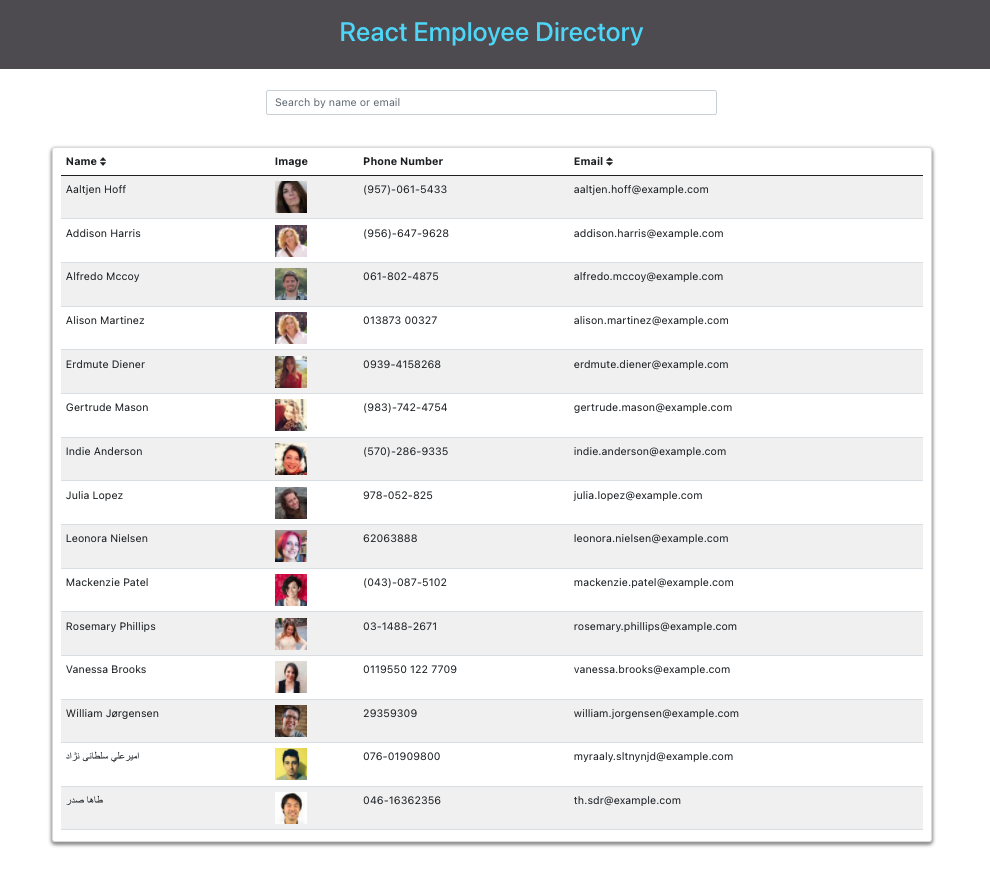

 <h1 align="center"><a href="https://johnsonr84.github.io/react-employee-directory/">👩‍💻 React Employee Directory 👨‍💻</a></h1>

  [](https://github.com/johnsonr84)
  [](https://github.com/johnsonr84/react-employee-directory)
  [](https://github.com/johnsonr84/react-employee-directory)
  [](https://choosealicense.com/licenses/mit/)
  [](https://nodejs.org/en/)
  [](https://www.npmjs.com/package/inquirer)
  
  ## Built With
  [](https://reactjs.org/)

  ## Table of Contents 
  * [Description](#Description)
  * [Project URL](#Project-URL)
  * [Deployment](#Deployment)
  * [Demo/Screenshots](#Demo/Screenshots)
  * [Installation](#Installation)
  * [Usage](#Usage)
  * [Credits](#Credits)
  * [License](#License)
  * [Resources](#Resources)
  * [Contact](#Contact)
  * [Author](#Author)
  #
  
  ## Acceptance Criteria
  Given a table of random users generated from the [Random User API](https://randomuser.me/), 
  when the user loads the page, a table of employees should render.

  The user should be able to:
  * Sort the table by at least one category
  * Filter the users by at least one property.
  
  ## Project URL
  https://github.com/johnsonr84/react-employee-directory

  ## Deployment
  https://johnsonr84.github.io/react-employee-directory/

  ## Demo/Screenshots
  <table>
    <tr>
      <td>react-employee-directory example</td>
    </tr>
    <tr>
      <td></td>
    </tr>
  </table>

  ## Technologies 
  ```
  React, React Hooks, Javascript, APIs, HTML5, CSS3 
  ```

  ## Installation 
   Access to GitHub.com and a code editor such as vscode is necessary. Click the GitHub link provided above to the APP REPO. Click on the green button that says Clone or Download and Choose how you would like to download: using the SSH/HTTPS keys or download the zip file. If using SSH/HTTPS Key: You will copy the link shown and open up either terminal (mac: pre-installed) or gitbash (pc: must be installed). Once the application is open, you will type git clone paste url here. If using Download ZIP: Click on Download Zip. Locate the file and double click it to unzip the file. Locate the unzipped folder and open it. 

  ## Usage 
  In order to use this APP, you need terminal (mac: pre-installed) or gitbash (pc: must be installed). You also need to download and install [node.js](https://nodejs.org/en/) and [npm](www.npmjs.com) or [yarn](https://yarnpkg.com/) package manager. Open the cloned REPO in your favorite code editor, and then in terminal, enter the command “npm i“ or “yarn add”  to install the dependencies.  Now you are ready to start using the app by entering “npm start” or "yarn start" on your terminal or gitbash. If you just want to try how the app works, you can go to the link [here](https://johnsonr84.github.io/react-employee-directory/)

  ## Credits 
  Me, myself and Irene 

  ## License 
  This project is [mit](https://choosealicense.com/licenses/mit/) licensed.

  ## Features
  Coming soon maybe 

  ## Tests
  npm test 

  ## Resources
  * [Choose a License](https://choosealicense.com/)
  * [Badmath](https://img.shields.io/github/languages/top/nielsenjared/badmath)
  * [shields.io](https://shields.io/)
  * [w3schools](https://www.w3schools.com/)
  * [stackoverflow.com](https://stackoverflow.com/)
  * [YouTube](https://www.youtube.com/)
  * [React.js](https://reactjs.org/)
  * [Random User API](https://randomuser.me/)
  * [Create React App docs for deployment.](https://create-react-app.dev/docs/deployment/#github-pages)
  * [Components and Props](https://reactjs.org/docs/components-and-props.html#es6-classes)
  * [State and Lifecycle](https://reactjs.org/docs/state-and-lifecycle.html)
  * [19-React-Activities](19-React-Activities)
  * [gh-pages](https://www.npmjs.com/package/gh-pages)


  ## Contact
  Email: robertcjohnson1984@gmail.com 

  ## Author
  Author(s): Rob Johnson  

  GitHub: https://github.com/johnsonr84/ 
